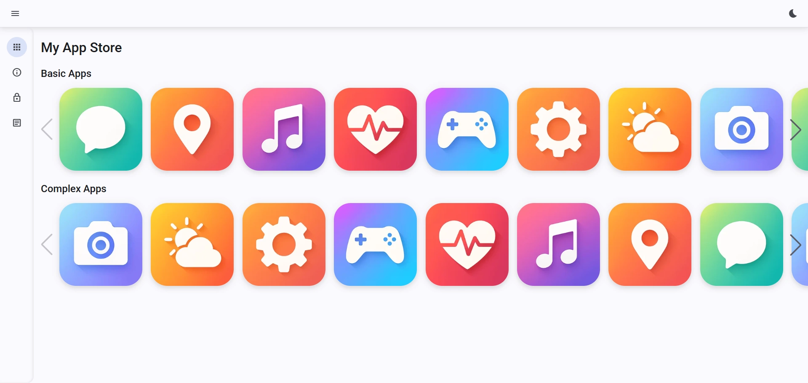
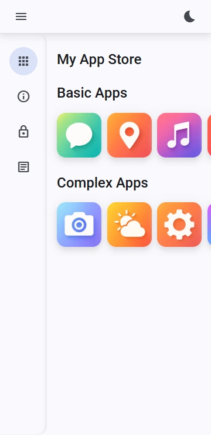

   

<div>
    
    
</div>

# My App Store

> **Developer Note:** This application was designed to demonstrate my proficiency in building modern, scalable web interfaces using Angular and Angular Material. More than just a visual demo, this project reflects my approach to software development: creating clean, intuitive user experiences backed by robust, component-based architecture.

It features a responsive layout, seamless navigation, and a refined UI inspired by industry standards. As a developer, I focus on writing maintainable code and leveraging the full potential of the Angular ecosystem to solve complex problems.

Explore the app to see my work in action!

## 🛠 Technical Implementation

This project leverages the cutting-edge features of **Angular 20** to deliver a high-performance, maintainable frontend architecture.

### Core Architecture & State

- **Zoneless Change Detection:** Implemented `provideZonelessChangeDetection()` for superior performance and smaller bundle sizes, moving away from traditional Zone.js overhead.
- **Standalone Architecture:** Fully modular design using Angular's latest Standalone Components API.
- **Advanced Routing:** Optimized with `PreloadAllModules` strategy to ensure seamless navigation while keeping initial load times minimal.

### UI & UX Components

- **Angular Material & CDK:** Utilized for high-quality, accessible UI components (Data tables, navigation, and overlays).
- **Interactive Galleries:** Integrated **PhotoSwipe** for professional-grade image interaction and **Swiper** for modern, touch-optimized carousels.
- **Custom Build Scripts:** Automated gallery manifest generation via custom Node.js scripts to streamline the asset pipeline.

### Engineering Practices

- **Reactive Programming:** Extensive use of **RxJS** for handling asynchronous data streams and HTTP requests.
- **Type Safety:** Built with **TypeScript 5.8**, ensuring strict typing and robust code quality.
- **Code Quality:** Prettier integration with custom Angular HTML parsing for consistent code formatting across the team.

### Project Structure

```text
src/
├── app/
│   ├── components/         # Reusable UI components
│   │   ├── custom-sidenav/ # Navigation logic & Material Sidenav
│   │   ├── logo-swiper/    # Swiper.js integration for brand display
│   │   └── product-details/# Product visualization logic
│   ├── pages/              # Main view components (routed)
│   │   ├── applications/   # Main app showcase
│   │   ├── info/           # General information page
│   │   ├── imprint/        # Legal imprint
│   │   ├── privacy-policy/ # Data protection details
│   │   └── not-found/      # 404 Error handling
│   ├── services/           # Data fetching & business logic
│   └── app.routes.ts       # Central routing configuration
├── scripts/                # Build scripts (e.g., gallery manifest generation)
└── styles/                 # Global styling & Angular Material themes
```

---

## 🚀 Getting Started

### Prerequisites

- **Node.js:** >= 20.x
- **Angular CLI:** 20.1.x

### Installation

1. Clone the repository:

   ```bash
   git clone https://github.com/43and18zeroes/my-app-store
   cd my-app-store
   ```

2. Install dependencies:

   ```bash
   npm install
   ```

3. Run the application:

   ```bash
   npm start
   ```
